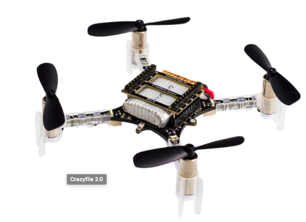
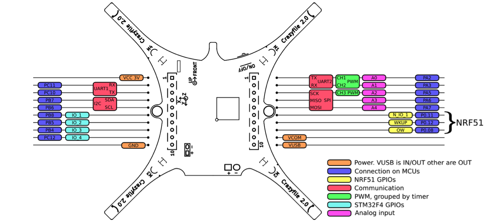

# IoT-drone
In this repository, we implement the simple control code for [Crazyflies](https://www.bitcraze.io/products/crazyflie-2-1/) drone.

**Figure 1: Crazyflie 2.1**

## Drone architecture
Source: https://www.bitcraze.io/documentation/hardware/crazyflie_2_1/crazyflie_2_1-datasheet.pdf

### 1. Introduction
The Crazyflie 2.1 is a versatile open source flying development platform that only weighs **27g** and fits in the palm of your hand. Crazyflie 2.1 is equipped with low-latency/long-range radio as well as Bluetooth LE. This gives you the option of downloading our app and using your mobile device as a controller or, in combination with the *Crazyradio PA*, using your computer to display data and fly with a game controller.

### 2. Onboard microcontrollers

- STM32F405 main application MCU (Cortex-M4, 168MHz, 192kb SRAM, 1Mb flash)
- nRF51822 radio and power management MCU (Cortex-M0, 32Mhz, 16kb SRAM, 128kb flash) micro-USB connector
- On-board LiPo charger with 100mA, 500mA and 980mA modes available
- Full speed USB device interface
- Partial USB OTG capability (USB OTG present but no 5V output)
- 8KB EEPROM

### 3. Specìications

- 3 axis accelerometer / gyroscope (BMI088) 
- High precision pressure sensor (BMP388)
- Flight time with stock battery: 7 minutes 
- Charging time with stock battery: 40 minutes 
- Max recommended payload weight: 15 g

- 2.4GHz ISM band radio
- Increased range with 20 dBm radio amplifier, tested to > 1 km range LOS with Crazyradio PA (environmentally dependent) Bluetooth Low Energy support with iOS and Android clients available
- Dual antenna support with both on board chip antenna and U.FL connector

### 4. Connector multiplexing

**Figure 2: Expansion connector multiplexing**

## Drone's document

Please take a look to this [document](docs/Drone_v1.pdf). In this document, we implemented drone's dynamic that is the simplest case as well as noted some solutions that we can try to fix the tracking issue.

## Sample code

We found 3 options to start with code but both of them require more set up for working:
- PX4: an open source that supported Crazyflies but it requires flow desk to solve hovering stably issue.
- [V1](samplecode/V1): a software, which was implemented by GrenobleINP's student, is focused to Crazyflie and PID controller. It had already perform well and fix to Crazyflies but it also requires Loco Positioning System for tracking issue.
- [Nordic's quadcopter](https://github.com/NordicPlayground/nrf52-quadcopter): this project is described in this [blog](https://www.hindawi.com/journals/js/2018/1253752/) post on Nordic Semiconductor's Developer Zone. Its result can be watched in this [link](https://www.facebook.com/watch/?v=1518123608213414). This code can't autonomous flight because of missing tracking position but we can learn how to implement roll-pitch-yaw calculation.
- [Cleanfight](https://github.com/cleanflight/cleanflight): an opensource project for drone which already implemented PID controller for drone but need to customize the parameter for our drone. It also requires one more thing to track 3D position.